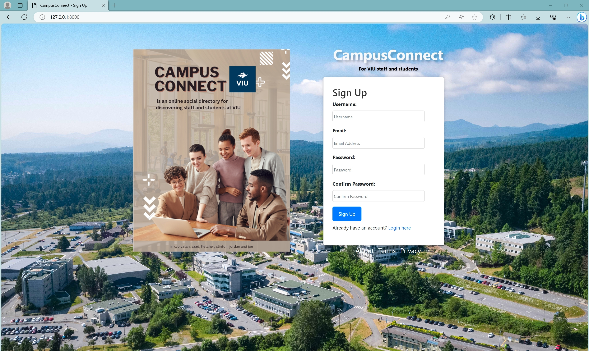
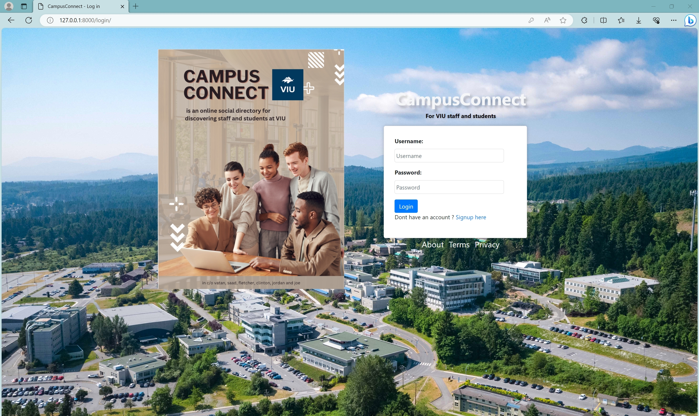
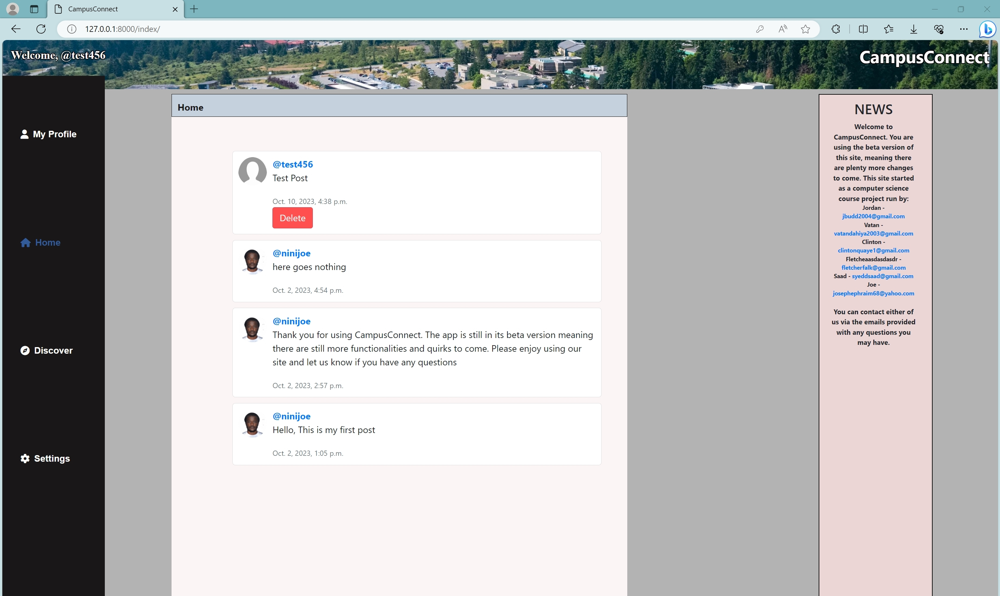
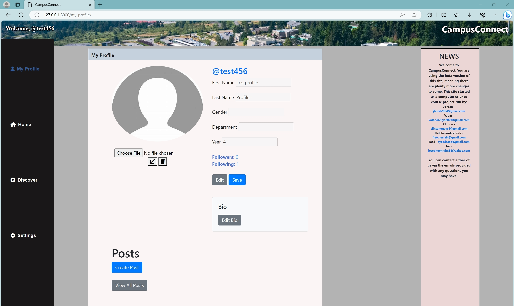
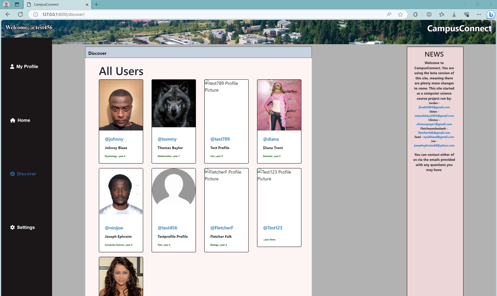
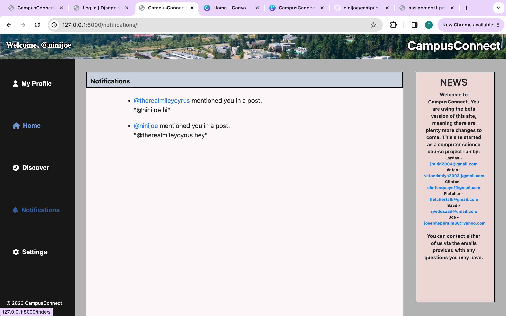

# Campus Connect - Specifications

## Team and Project Information
- **Team Name**: [Cavemen Coders]
- **Project Name**: [Campus Connect]
- **Contact Information**: [josephephraim68@yahoo.com]

## Table of Contents 
- [Product Overview]
- [Product Behavior/Features]
- [User Interfaces/Product Visualizations]
- [Key Use Cases/Scenarios]
- [Non-Functional Requirements]
- [Glossary]

## Product Overview

### Purpose & Significance
 Campus Connect will serve as an online social directory web application designed to foster connections and collaboration among students and faculty within the academic community.

Its significance lies in creating a simple, user-friendly platform that authentically connects individuals, providing a space for students and faculty to create profiles, share information, and interact. By offering a central hub for networking and communication, Campus Connect enhances the sense of community on campus, facilitates academic and social engagement, and promotes a seamless exchange of knowledge and ideas among its users. It aims to bridge the gap between students and faculty, ultimately contributing to a more connected and cohesive academic environment.

### Target Audience
At its essence, Campus Connect is being  crafted to cater primarily to the student and faculty community of Vancouver Island University. Should all go according to plan, its versatile architecture allows for scalability, paving the way for potential utilization by other post-secondary institutions.

### Scope
Cavemen Coders will adhere to a planned timeline encompassing development, testing, and deployment phases. During this period, the primary objective is to achieve the successful launch of a web-based application. Our commitment extends to ensuring that all initially agreed-upon features from the project's initial phase operate seamlessly and without any issues (for detailed feature information, refer to ## Product Behavior/Features ##).

Moreover, we remain flexible in our approach, ready to adapt the project's scalability, whether upwards or downwards, depending on the evolving progress and requirements, thereby ensuring optimal alignment with our project goals and objectives.
 
### Operating Environments/Platforms
- Campus Connect will be accessible exclusively through web browsers, made available via a yet-to-be-generated link. This web-based application is designed to offer users a seamless online experience while adhering to professional standards of accessibility and usability. 

## Product Behavior/Features

### Feature 1: [User profile creation]

#### Description
Upon making their way on to the Campus Connect landing page, users have the option of creating an account or setting up their profile as they see fit all while abiding by standard regualtions and policies.

### Feature 2: [User authentication]

#### Description
To verify the aunthenticity of  the user creating the account, a link which redirects users to the original landing page is sent to the email which was provided at sign up. This will allow verification of an actual user and hopefully prevent acts of bots on the page.
This can be further adapted in the future as we can potentially discuss a form of two-factor authentication for further verification of user authenticity.

### Feature 3 : [Profile search and view]

#### Description
Users will have the ability to search up existing users by username and interact with their profiles. Users also have access to a discovery page in order form new connections with other users with the ability to narrow the search by department.

### Feature 4 : [Privacy controls]

#### Description
Users are given the ability to share as much information as is comfortable with them. Privacy features will be further researched but will follow directly with VIU's guidelines as stated in the Legislation and VIU's Privacy Management Program in compliance with BC's Freedom of Information and Protection of Privacy Act (FIPPA).

This includes our job as creators of CampusConnect to protect their personal information and ensure we have it collected, used, and disclosed in a appropriate private manner. This is currently be actively researched and worked on in our team as we continue to lead the application toward a public website.

### Feature 5 : [Any form of communication or user interaction]

#### Description
Users are given the ability to create their own posts on their account. These posts are going to be the main form of communication of the site keeping discussions public rather than including private messaging. This choice was made in order to give other users the ability to see advice given to other users and possibly answer questions they might have but are not sure how to ask.
This works towards our key goal for CampusConnect to make it a public social directory open to all.

### Feature 6 : [Receiving Notifications]

#### Description
Users are given the ability to monitor activity of other users they follow. On clicking on the notifications page now added on the website, a user may see likes on their post, comments, and new posts made by other users. This is more of a speciality feature than a required feature that will allow easier access and communications with others by having a quick link to new conversations other users generate. 

### Feature 7 : [Group Features]

#### Description
Users are given the ability to join "groups" on the webpage and see other active users of the group. This feature has lots of room for growth and will intially just be in the form of a list of other users of the group. Projections for this feature will allow a seperate group page with group post options to have a closed section for questions and answers related to their field.

## User Interfaces/Product Visualizations

- 
Signup Page is the main page that will first appear when I user accesses the website. Key elements of this page include four fields: one for username, one for email, and two for password and confirm password. This is followed by a sign up button which upon successful verification of email and entering the correct password twice, will allow the user to successfully create their account. 
This page will also include an alternative link to the login page if the user already has an account. As well as additional links to the privacy and term policies.

- 
Login Page is the alternative page to signup once the user already has an existing account. Key elements on this page include two fields: one for username and one for password. This is followed up by a login button that upon successful authentication of account info will sign the user into their account directing them to the home page of the website.
Additional features will include alternative link back to signup page, forget your credentials options, as well as a link to privacy and term policies.

- 
Home Page is the main page where communication will take place on the site. When a user makes a connection of the discover page with another user and chooses to follow their account, any posts they may make will appear in the home page. This allows the user to help answer questions other users may have and even ask their own questions to get answered.

- 
My Profile is the main page where the users profile customization occurs. The user will be given access to certain profile customization features such as: Profile Picture, First Name, Last Name, Gender, Department, and Year of Study. These features may be adapted in the future but the goal was to keep it simple and only include info necessary rather than adapting it to a full fledged social media app.
Additional feature of the page is the ability for the user to create a new post to ask any questions or discuss a specific topic. This post will be visible only to the user and any other users who follow them on their own home page.

- 
Discover Page has been chosen as the first page the user will access after first creating their account. This has been chosen as it directly gives the user access to other users of CampusConnect and helps direct them to making their first connection with another user, the main goal of the site. 
In the future the discover page is planned to be more advanced with specific tabs to different departments to help the user connect with other users they may have specific questions for.

Notifications Page has been chosen as a supporting page to many of the other actions that occur on CampusConnect. This will allow the user to have shortcuts to each different feature on the website.
This will allow the user to see posts made by other users they follow, comments, likes, and more as the page grows. This is an important feature for a social directory as it allows for easier access for communication between others.

- Groups Page
Groups Page is currently being researched and implemented and will hopefully be fully developed for the next phase. This is currently brainstormed as a separate page that will allow the user to access different groups by department in order to find users that have more in common with them. This section will be further expanded on as the development continues.

## Key Use Cases/Scenarios

### Use Case 1: Creation and login of a new account:

#### Description
User will enter the websites url on their web browser of preferred device. Upon entry to the site, new user is prompted to create their own account by filling in four fields: Username, Email, Password, and Confirmation of Password. After filling in all four fields user may click the sign up button, and with the correct confirm password will be given access to a new account.

This info is verified in the system by sending a confirmation to their entered email address. After confirmation the user is added into the database of active users.

Upon entering the website at another time period the user may now click on the alternative link to the login page and enter their appropriate credientials to access their account.

### Use Case 2: Modification of new user profile:

#### Description
After creating a new profile the user may want to modify the profile to accurately represent themselves. This begins when the user clicks on the My Profile page. Upon entry to the page the user may click edit on their profile and fill in the 6 fields discussed under the Profile image in User Interface. 

After modification the user may save that new info which will be updated in the servers database to become public to any other user viewing their account.

### Use Case 3: Discovering and following other users:

#### Description
After creating a new account as discussed earlier, the new user will be directed to the discover page. Currently the user will have access to see all other users of CampusConnect of the discover page to connect with others. In the future this will likely be changed when their are many members on the page to sort more specifically by department. 
However, as of now when the user sees an account they are interested in they may click on the profile to see their current info they have given about themselves. They will then be given the prompt to follow the account. Upon following the account this makes a request with the application to add this users posts to their own Home Page for the current users viewing.
Discovering new users is the main goal of CampusConnect and this is one of the key features that will be further advanced to work swiftly and flawlessly. 

### Use Case 4: Creating a new post:

#### Description
When the user makes the decision to create a new post they will first go to their My Profile page. Upon entry they may click on the button titled "Creat Post". This will prompt the user to enter any question or discussion into a text box and post it. Upon clicking the post button this sends a request to the application to publish the post on the Home Page.
With the post now being public any other user that is following the current user will now have access to view their latest post in their Home Page as well.

### Use Case 5: Joining a group:

#### Description
When the user makes the decision to join a group, they will go to the Groups page. Upon entry they may click on different groups from a variety of departments and "follow it". After this prompt the user may view other users on the group page to have direct contact with them. In the future this feature may link together with creating a new post in order to make a "Group post".

## Non-Functional Requirements

### Performance Requirements
As a web application the goal is to maintain fast user load times and constant connection to the user even in the case of heavy traffic with the server. Users should be able to rapidly go from page to page and have no delay when creating a new post.
Research is currently being conducted into standards CampusConnect will follow to help maintain accurate performance of the application. These include removing duplicates of CSS, removing any excessive or unsupported components, and avoiding large amounts of http redirects that could slow the page.

### Quality Requirements
CampusConnects background components are actively being coded using the Django python framework. As we continue to add more features code will become more advanced. However, we are actively bug testing as new features are added to maintain reliability and efficiency of the application before it is delivered to the user. New features will always begin with sample templates and basic design componenets to develop the core of the feature before advancing it out of our scope.

### Security Requirements
CampusConnect will follow and implement some key security requirements used by web applications. These include SSL certification, encryption of users data and passwords, validating and preventing injection attacks from user input, and keeping relevant backups of the application.

Future scalability of the application could lead to the plan of hiring certified third parties to do web attack testing and frequent monitoring of logs to further advance our security. 

## Glossary
1. Web Application: an application software that is accesses via a web browser to perform a particular function. Each program will have a client side and a server side allowing the user to run the application while the server processes necassary processes in the background.

2. FIPPA: Freedom of Information and Protection of Privacy Act in BC which provides a right of access to records held by public bodies and regulates how public bodies manage personal information. FIPPA also provides independent review for those who disagree with privacy decisions made by public bodies under the act.

3. SSL Certification: a protocol for encrypting Internet traffic and verifying server identity. This is sent to any devices that load the website to verify ownership of the website and prevent attackers from creating a fake version.
