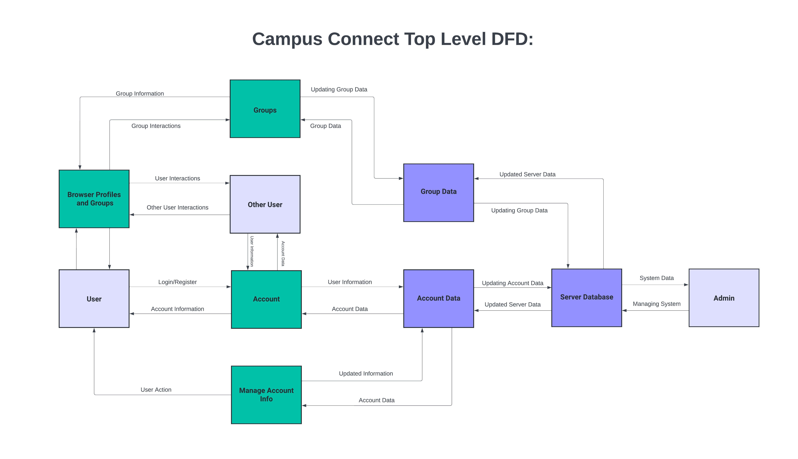
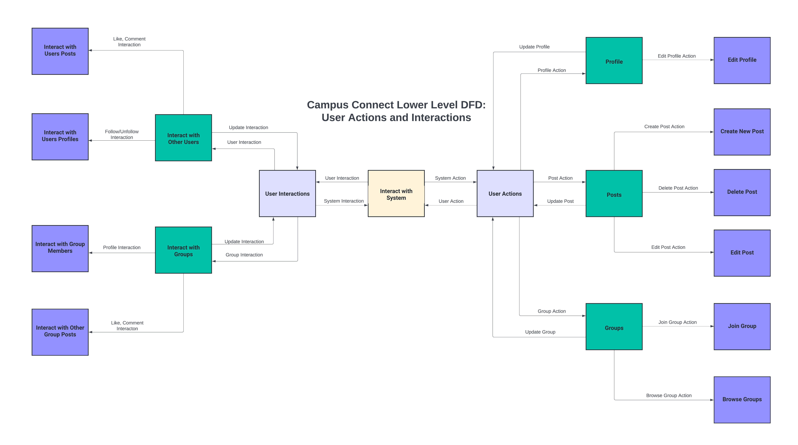
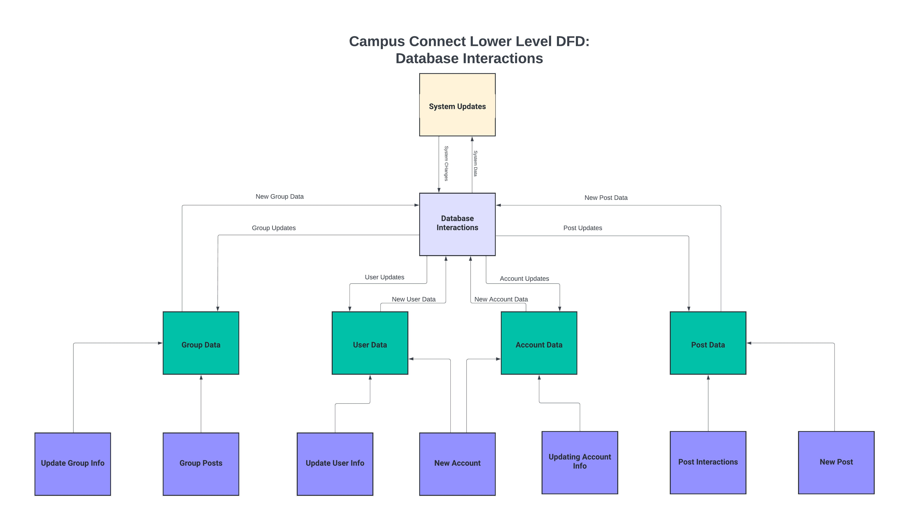
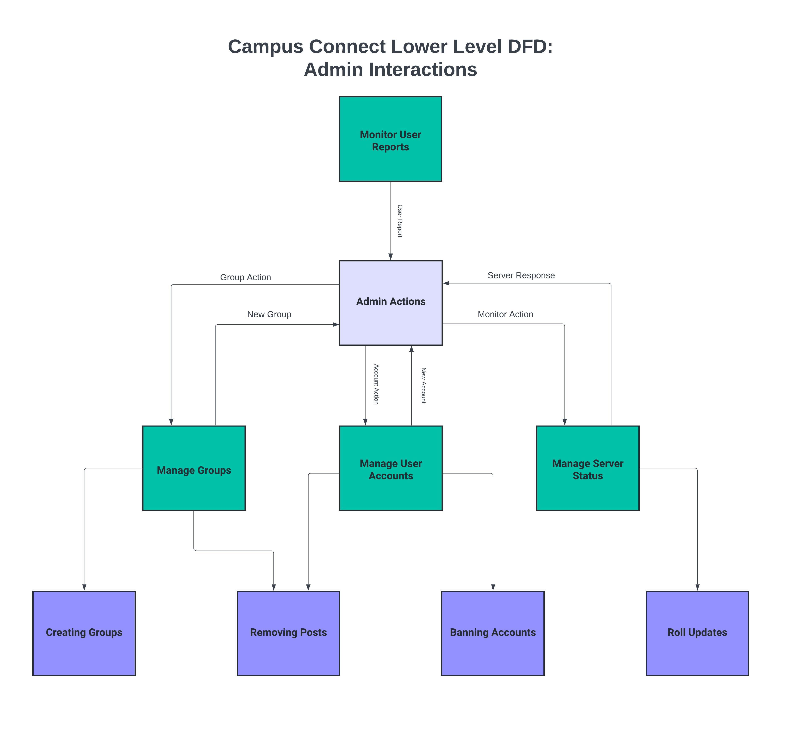
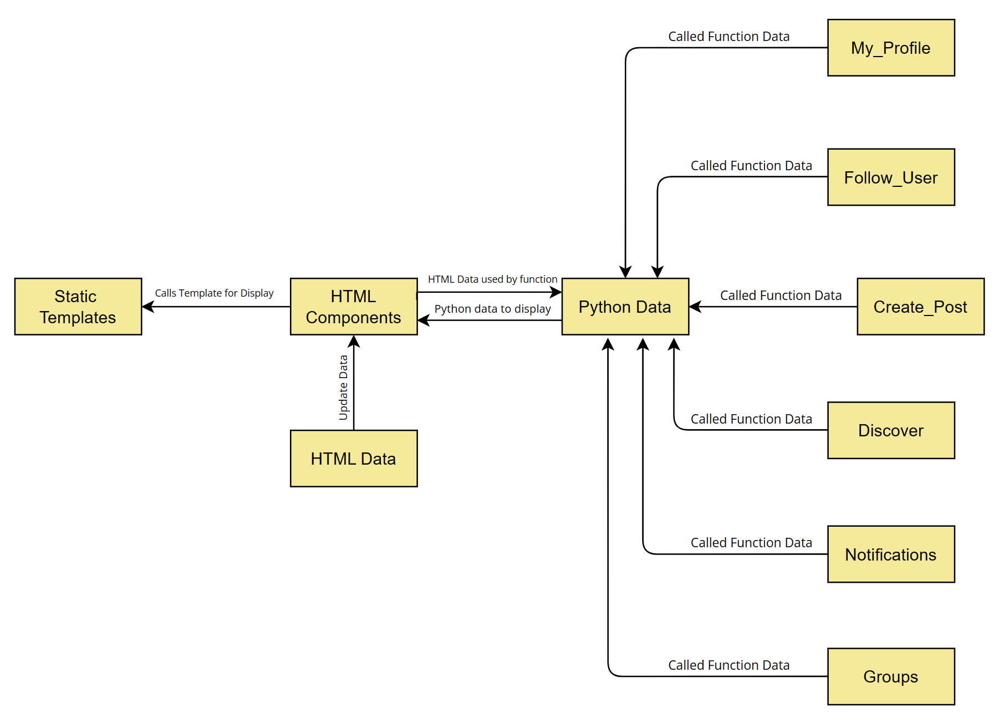

# Campus Connect - Design Documentation

## Team and Project Information
- **Team Name**: [Cavemen Coders]
- **Project Name**: [Campus Connect]
- **Contact Information**: [josephephraim68@yahoo.com]

## Table of Contents 
- [Design Overview]
- [Logical Design]
- [Physical Design]
- [Glossary]

## Design Overview
### Top Level Design of CampusConnect:
The Design of CampusConnect follows the important big data sources of the website. The key to this is the user. Without a user on our website there will be no generation of data and storage used. This diagram below will go into the highest level diagram which will be split into lower levels discussed later in the document.

- 

The Top Level Data flow diagram of CampusConnect clearly describes the main interactions and transformations that occur on the website. The key member in this context diagram is the User. The Users interactions is the key driving factor to resulting data that is stored on the server database. 

Key High Level Interactions and Their Explanations:
1. Creating an Account: New account data will be sent in from the user including username, password, and email which is then stored on the server database for future logins.
These interactions will require the input account data to be updated on the server database.
Correlating with logical design new users are created corresponding to a specific user class that have data fields for user customization features. This will allow for a static set of permissions to all users by default.

2. Managing Account Info: Present accounts may be modified by their corresponding owner to change their password or email in case of attack attempts or being forgetten.
Changes made will directly affect the account data which will be updated on the server database.
Correlating with logical design this will be similar to creating an account where instead the users private data will be updated and re-established on the server database.

3. Interacting with Other Users: Present users may browse other users on the website. These interactions made may lead to updates in user information and account data which is then sent to the server database.
Correlating with logical design interactions made with other users will be tied and stored on the specific user datafields. These will include data attributes that can be called such as followers, following, likes, and posts.

4. Interacting with Groups: Present users may browse other groups on the website. These will be unique to specific departments and allow for the user to interaction with students in their major.
Interactions the user makes will update group data which is then stored on the server database.
Correlating with logical design, groups will be made as a separate public datafield that can be called be the user to view. These will include interactions made in the group by other users and predetermined data placed by the developers.

5. Admin Interactions: Administrator user will have direct access to all created data on the server database excluding sensitive information like passwords. This will allow for system changes to be made directly in the case of inappropriate actions made on the server or updates.
Correlating with logical design, an admin user will have a private class with a unique set of permissions in order to access the system data and components. Necessary for monitoring status of the website in early stages and for scalability and future moderation of users actions.

## Logical Design
### Lower Level Diagram of User Actions and Interactions on CampusConnect
The Lower Level Design of CampusConnect begins with the users actions and interactions o the site. These interactions revolve around the system, where each action has to be updated. This is important considering data is constantly called by other users which requires the most recent data of the site.

- 

User Actions and Interactions are one of the most important components of the system and require an in-depth decomposition. With CampusConnect being a social platform for students, users are the key driving factor behind new data that will be stored on the system. New user data is split into two key components, data created from users actions and data created by users interactions.

Key User Actions:
1. Profile: The users profile is the main backbone of CampusConnect which allows the user to personalize their profile to themselves. Once the account is created the user may perform specific actions on their profile. These include uploading a profile picture, changing their display name, year of study, gender, department, and short bio. These are simple fill-in-fields that interactions directly with input given by the user. This input is then stored in the system specifically to each component: an image file for picture, a string for first and last name, an int for year of study, and a string for gender and department which is limited by the system. All the actions performed by the user will interact directly with the system to update the information given by the users input.

2. Posts: Posts are another important component of CampusConnect being the main form of communication done on the website. The user has multiple actions that can be made involving posts. A post can be created intially by a user taking their input directly and storing it in the system to be displayed publically to all users that are following them. A post can also be deleted by a user which will be updated in the system and on all other users accounts. A post can finally be edited by the user similar to creating a post which instead updates the existing data stored on the server database to the new input given by the user. All these actions performed by the user have to then be updated to the system database for availability when called by the user again or another user browsing there page. 

3. Groups: Groups are a exclusive feature to the website that will allow a user to directly connect with users in their similar department or major. This comes with exclusive actions performed by the user to the group and group data. The basic action a user can make is browsing the group page for different groups. This involves simple input by the user to look at groups and does not require any changes to be made on the users end. Basic group data will be available to view for all users such as a description of the group and title. Joining a group is the second feature available. This will update the users class to include access to the data available publically in the group. Joining a group will have many interactions with system data and users data as previous posts, comments, and interactions between other members will now be displayed to the user that joins the group. All new interactions the user can make will then interat with the system and thus update the system data.

Key User Interactions:
1. Interacting with Users: Interactions made between users are going to be one of the largest sources of data on the website. The first key interaction available to the user is interacting with users posts which include liking, commenting, and replying to other comments. Likes will be a integer stored along with the users post that are displayed to all other users and increased on users input of clicking the like button. Comments are another feature tied and stored with a users post which interact directly with other users as they will modify the users post data when posting a comment. The second key interaction available to the user is interacting with other users profiles. This will include calling and viewing public information they user displayed as described in the profile section of the upper level DFD, as well as following the profile. When following another user this will increase the integer stored and displayed on their profile of there following count as well as give you access to the users post data to be displayed on your Home page. There are many interactions that take place between users on the server but all link back to the system and database which is constantly updated by the user.

2. Interacting with Groups: Interactions made with groups are very similar to interactions with users with some key differences. The first interactions include those made with group posts. A key difference involves access to this post, as unlike having to follow the user first, once a user is in a group they will be able to see all new posts made in the group. This is due to change made in the users class giving him access to all group data previously made and group data that will be made in the future. Users interacting with group posts will then have the same features as mentioned above in interactions made with user posts. The second interaction are between group members. This will very similar to the discover page which allows you user to see other members of the group and browse/interact with their profile. Despite being similar to user interactions group interactions are seperate in the type of data being sent to the server as it has to be updated for all users that are associated in the group class requiring different interactions made with the server database. 

### Lower Level Diagram of Database Interactions on CampusConnect:
This level similar to user actions and interactions revolves around new data generated and data updated which is sent to the system to update. These are generated by the user which is discussed below including account data, user data, post data, and group data.

- 

The System Database is the core component that is directly linked to the actions and interactions made by the user. The key goal with CampusConnect was to make a social platform with the main goal of a public space for questions and help between students. This is stepping slightly away from the standard interactions made on a complete social media platform. Limiting certain unnecessary social sharing to strongly focus on the communication aspects of the app. These key communication aspects all are correlated with their own exclusive type of data they send to the system.

The system has four key types of data that is directly sent from the database and updated back from the database itself:

Key Database Interactions:
1. User Data: User data is exclusively created by the user themselves based on their given inputs to the system. This direct interaction with the user allows the data to be stored and linear sent to the system with no other interactions. The only time this data is required by other users is when they click on a profile calling the stored data to be displayed. Users have specific public data available to be called as mentioned in profile in the higher level diagram. After creating a new account, all interactions made with the database are exclusively going to be updates to previous user information.

2. Group Data: Group data is a more specialized form of user data. This data will be specialized in having a direct link to the group pages rather than the discover page. New forms of group data include posts made on the group page, interactions with group posts, and new users joining the group. There is some link between user data and group data as updates made by a users profile will have to be sent to be updated on the group page when other users see their group posts. All updates to group data will interact directly with the database to then update on other users data when called upon.

3. Account Data: Account data is different from user data in being a private form of data storage. This includes information given by new accounts such as username, password, and email address. This data is made when a user creates an account for the first time and stored exclusively in a private accounts folder that is only accessible by a developer or admin. A user may make modifications to this data but can only call username or email back to them after further authentication. This is in order to maintain authenticity of an account and prevent any hacking from taking place.

4. Post Data: Post data is unique to direct interactions made between users and will often feel linked to user data despite being seperate. Although you can see users who make posts and their profile post data is specifically for two types of interactions. The first being creation of a post where a user will give input to the system which is stored in the database and displayed publically to all following users. The second is interactions made of the a post. These interactions are mentioned above in the interactions between users section but will include specific storages tied to a post such as likes, comments, and replys. This data has to be sent directly to the database as viewing a post by another user will require calling updated post data to see most recent updates.

### Lower Level Diagram of Admin Interactions on CampusConnect:
This level is the supporting lower level for all data interactions on the website. There are many user inputs and outputs that can occur that require actively looking at system data to monitor users in regards to the systems terms and conditions.

- 

Admin Interactions are not as much of a core component of CampusConnect but still important considering scalability purposes. The main action that will always need to be made by an active admin is managing the status of the server and updates. However, a key goal for the current project is to have hands-on moderation primarily using a banned keywords list or other filteration. But, as the system grows their will eventually be the need for active moderation of the website.

Therefore at this current time period their are three key interactions made by the admin that can potentially be influenced by reports made by other users on the site:

Key Admin Interactions:
1. Managing Groups: Groups that are made by admins will be stored on the server database as group data as mentioned in the upper level DFD. Admins can perform actions that include removing posts made on the group thread and managing members that are followed to the group. Another action will be creating new groups, groups are going to be preset created by the admin or developer for each department to prevent exclusion of users from discussions that may be beneficial to them. New groups will be initialized as a new database to be filled with user input in the form of posts and users data that is presented to a other users when they click on the group.

2. Managing User Accounts: Accounts that are made by users will be stored as account data in the server database as mentioned in the upper level DFD. Admins will have the ability to actively manage these accounts in the case an account does not follow specific code of conduct on the site. These can include directly removing post data by the specific user to removal of all account data associated with the user on the account database. 

3. Managing Server Status: Server status is one of the most important actions an admin will be monitoring. In an event of a server downtime period their will be no actions available to the users. These downtimes can be monitored by the admin and reported to our developers to fix errors causing the issue. Without this action their could be extended periods of downtime which can negatively effect the user experience and usage of the site. 
Updates are also an important component of the website. Rolling updates will be another important action performed by administrators working hand in hand with the developers to keep CampusConnect running smoothly.

## Physical Design
### DFD of Physical Design on CampusConnect:
The physical design of CampusConnect will utilize python database along with HTML calls. This will allow for simplicity of the codebase while being able to have our design team and backend developers to work hand and hand together.

- 

Key backbone components of CampusConnect will be ran on the Python Django framework, a unique tool that supports development of web sites using Python. As such the core background components of the website will be coded in Python.
The core visuals on the website will be linked together with Python, CSS, and some Javascript. This will allow for flashy visuals, basic animations, and core components such as buttons and more all linked in one.

The Physical Design of CampusConnect can be split into two key components:

1. Core HTML Components:
The basic core components of the webpage include the static templates. These are key images and html that stay locked on the page at all times. This allows for simplicity of the code by just having a flexible center screen based on the page being currently displaced to the user. These static templates are stored in a specific directory of the GitHub and constantly called upon by the system when a user logs onto the page. Additonal templates for each page are stored in an additional directory as html documents called on by page the user is currently viewing. This allows for us as developers to have easy access to the design of the website while also keeping it simple for access by the user. These pages are previously mentioned in our specs document but include Discover Page, Login Page, My Profile, Notifications, Settings and more. 

2. Core Python Data Structures:
The rest of the data stored by the system include python code files that link together the core logical design of CampusConnect.
The basic datafields of a user class include a file for specific user information, specific account information, and permissions. This can be modified by the user in the application directly updating the information stored in the user class data. A more advanced data structure includes that of a group. This can not be modified by the user and is pre-set by the admin/developer. However, there are many files associated with a group that are updated directly and indirectly by a user including member list, posts, and more.

List of Basic Function Skeletons:
- My_Profile: This function is called by the current user when accessing the My Profile page of the site. This function will take in input from the user for specific user fields as mentioned previously in the document for profile customization. This function returns these values to the html document to be updated to the user and other users viewing the site.

- Follow_User: This function is called when a user will request to follow another user on the site. This will be linked to many other functions to allow update of other user data on their Home page. This function will return updates to the User Profile html to showcase if they are currently following the user.

- Create_Post: This function is calledr when a user creates a new post taking in a request for user input. Upon completion and posting it will return the user back to the previous page while updating their html document calling a Display_Post function that retrieves all users active posts.

- Discover: This function will be called when a user clicks on the Discover page of the site. This function is fairly simple just taking in input from all user objects and updating and returning the discover.html to be displayed to the active user.

- Notifications: This function is called when a user is mentioned by another user or when a user they followed makes new activity of the site. This actions are loaded when the user clicks on the Notifications page and takes input from all user objects they follow to be returned to the notifications.html document and displayed to the user.

- Groups: This function is actively being worked on but will be called by the user when clicking on the Group page. This will likely follow similar dynamics as the discover page allowing access to each group. Initially development will begin by just calling all user objects associated with that group and returning them to the group.html document and will likely extend to further development with a Create_Group_Post function in the future.

As the project grows their will be many more functions required and used by the application however, above currently covers the most used functions and ones prioritized by the development team for basic components of CampusConnect.

## Glossary
1. Data Flow Diagram (DFD): a graphical representation of the information flow in a process or system. This uses defined symbols with arrows and test to show data inputs, outputs, and routes between them.

2. Datafield: known as data attributes, data traits, and data characteristics commonly in the form of a data table that can be called upon.

3. Class: basic functional method for holding data allowing an object to be assigned specific data members that can be called upon.

4. Django: a high-level Python web framework built by experience developers suited to handling the hassle of web development allowing a solid framework to be setup for the user to expand on.
